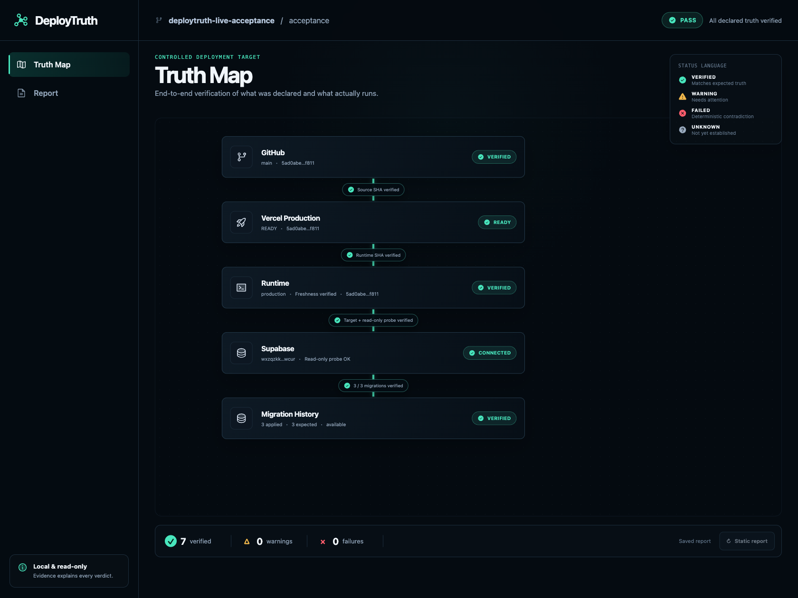
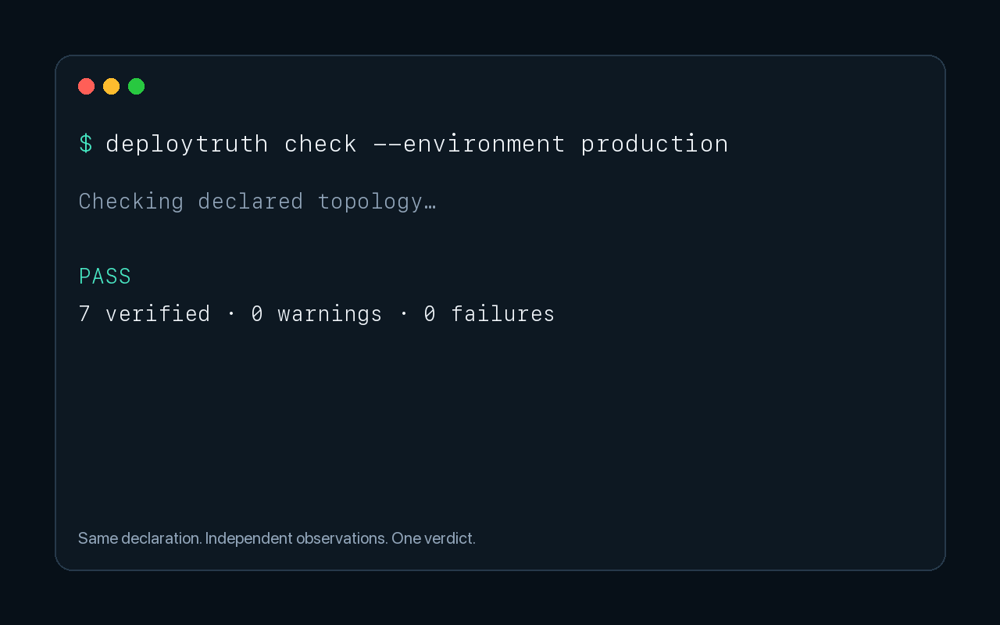
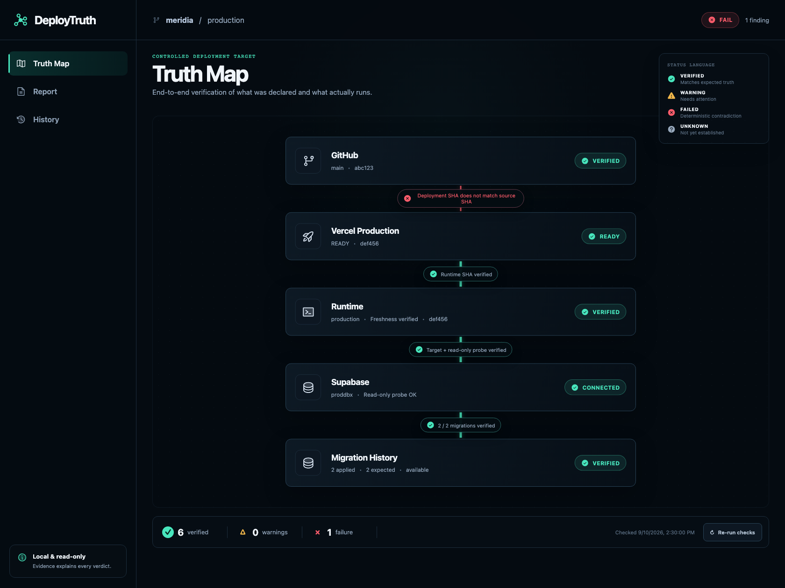
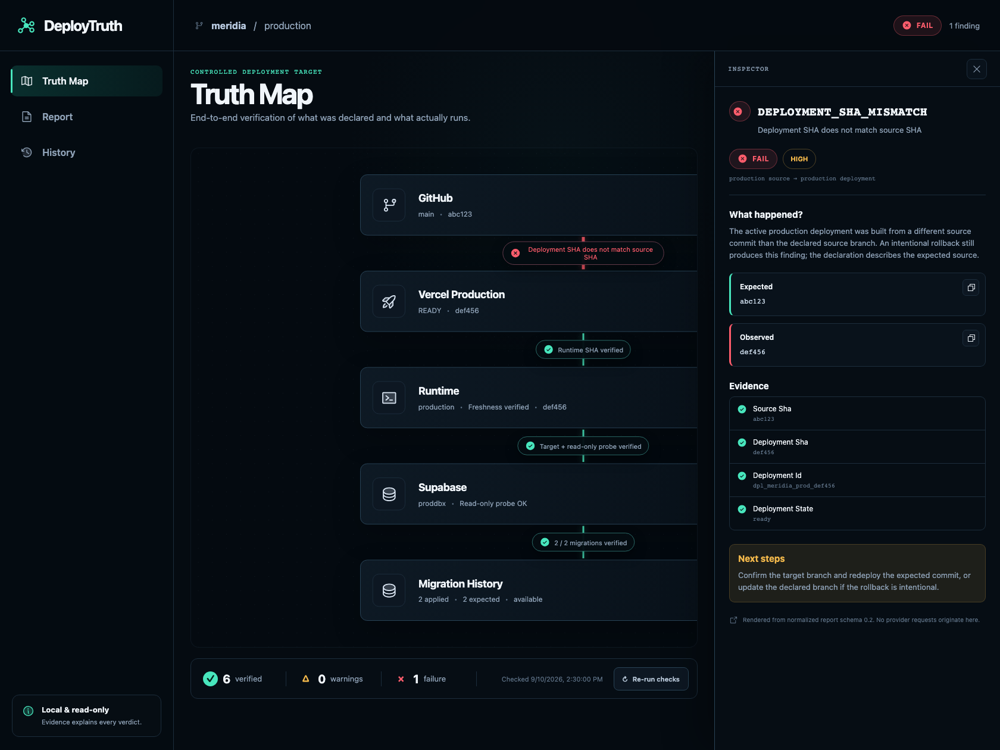
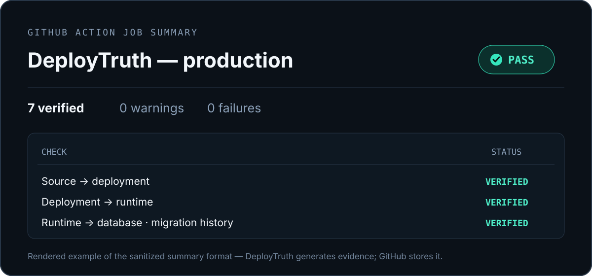
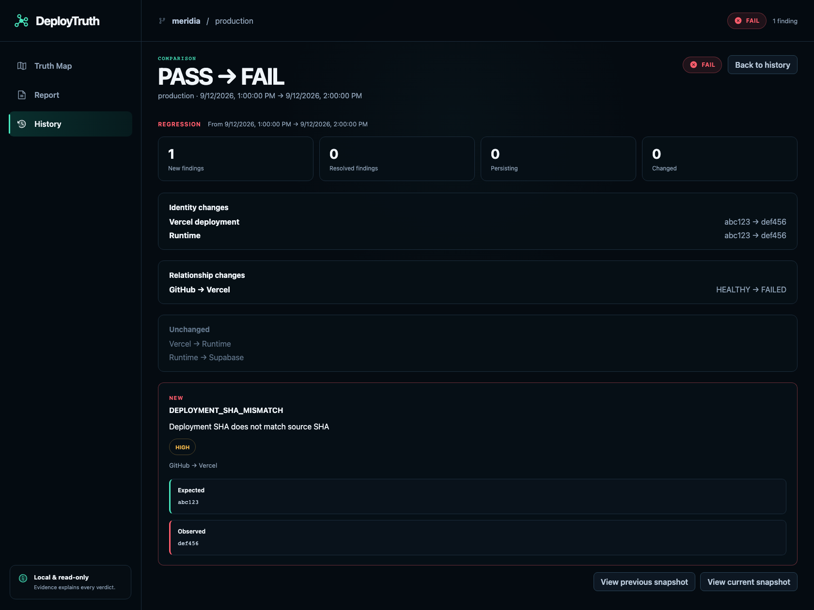

# DeployTruth

[](https://github.com/Cristian0101/deploytruth/actions/workflows/ci.yml)
[](package.json)
[](LICENSE)

**git status for your deployed application.**

Your repository says one thing. Your deployment platform says another. Your running application
may be connected to something else entirely. DeployTruth checks each layer independently and
shows where declared state and observed reality diverge.



### 19-second product tour



The healthy frame is a controlled live-acceptance report. The failure and regression frames use
certified deterministic fixtures; they do not represent a current production incident.

> **Release candidate:** DeployTruth is pre-1.0 and has not been published to npm yet. The npm and
> GitHub Action examples below are the intended v0.1 install paths; use the source-checkout path to
> evaluate the current candidate today.

## The problem

```text
GitHub main          abc123
       ╳             DEPLOYMENT_SHA_MISMATCH
Vercel Production   def456   READY
       ✓
Runtime             def456   VERIFIED
```

GitHub can be healthy. Vercel can be healthy. Supabase can be healthy. Your system can still be
wrong.

DeployTruth checks the relationships between providers, not merely whether each provider is up.
It catches a production deployment built from the wrong commit without incorrectly blaming the
healthy deployment-to-runtime relationship.



Select a failed relationship to see the finding code, severity, expected and observed values,
evidence, and a concrete next step.



## What DeployTruth checks

| Layer             | What DeployTruth observes                                                           |
| ----------------- | ----------------------------------------------------------------------------------- |
| Local Git         | Branch, HEAD, worktree, upstream, divergence, worktrees, and in-progress operations |
| GitHub            | The authoritative repository and branch HEAD                                        |
| Vercel            | The active production deployment, commit, readiness, aliases, and stable domain     |
| Runtime           | Fresh nonce-bound attestation of the running SHA, environment, and DB connection    |
| Supabase          | Project access, verified database identity, and read-only connectivity              |
| Migration History | Repository migrations compared with applied Supabase migrations                     |

Memorable findings include `DEPLOYMENT_SHA_MISMATCH`, `RUNTIME_SHA_MISMATCH`,
`RUNTIME_DATABASE_PROJECT_MISMATCH`, `WRONG_DATABASE_PROJECT`,
`DATABASE_MIGRATIONS_BEHIND`, and `STALE_TRACKING_REF`. See the searchable
[finding reference](docs/findings.md) for the complete current registry.

## Quick start

DeployTruth requires Node.js 22 or later.

### CLI user

After the first npm release, run without installing:

```bash
npx deploytruth --help
```

or install the CLI globally:

```bash
npm install -g deploytruth
deploytruth --help
```

The five-minute path is:

```bash
deploytruth init
# Edit deploytruth.yml with public identifiers; keep credentials in environment variables.
deploytruth doctor
deploytruth check --environment production
deploytruth open --environment production
```

Until npm publication, evaluate the exact release candidate from a source checkout:

```bash
git clone https://github.com/Cristian0101/deploytruth.git
cd deploytruth
corepack enable
pnpm install --frozen-lockfile
pnpm build
node packages/cli/dist/index.js --help
```

See [configuration](docs/configuration.md) for the manifest and credential variable names, and
[CLI reference](docs/cli.md) for flags and exit behavior.

## Configuration

`deploytruth.yml` contains non-secret identities only:

<!-- docs-test:quick-config:start -->

```yaml
version: 1
project: my-app

environments:
  production:
    kind: production
    source:
      provider: github
      repository: acme/my-app
      branch: main
    deployment:
      provider: vercel
      project: my-app
      target: production
    database:
      provider: supabase
      project_ref: yourprojectref
      migrations:
        directory: supabase/migrations
    runtime:
      url: https://app.example.com/api/deploytruth/runtime
      expected_environment: production
    required_environment_variables:
      - SUPABASE_URL
    checks:
      local_git: true
      remote_source: true
      deployment_sha: true
      migrations: true
      runtime_identity: true
      environment_isolation: true
      environment_variables: true
```

<!-- docs-test:quick-config:end -->

Provider credentials stay outside this file. The preferred variables are
`DEPLOYTRUTH_GITHUB_TOKEN`, `DEPLOYTRUTH_VERCEL_TOKEN`,
`DEPLOYTRUTH_SUPABASE_ACCESS_TOKEN`, and `DEPLOYTRUTH_SUPABASE_DATABASE_URL`. Public GitHub
repositories can be observed without a token at lower rate limits. Never commit credential
values.

The full supported-key reference is in [docs/configuration.md](docs/configuration.md).

## Visual Truth Map

```bash
deploytruth open --environment production
```

`open` performs the same check as the CLI, then serves the report on a private, loopback-only
address. The browser view includes the Truth Map, factual Inspector, normalized Report, and local
History. It does not contact providers from the browser or evaluate a second set of rules.

## CI certification

The JavaScript Action runs the same truth engine and produces a GitHub Job Summary, machine
outputs, and a sanitized evidence bundle. The `v0` ref shown here is the intended moving pre-1.0
release ref and **does not exist until the release phase creates it**.

<!-- docs-test:action-example:start -->

```yaml
name: DeployTruth

on:
  workflow_dispatch:

permissions:
  contents: read

jobs:
  certify:
    runs-on: ubuntu-latest
    steps:
      - uses: actions/checkout@v7
      - id: deploytruth
        uses: Cristian0101/deploytruth@v0 # available after the first release
        with:
          environment: production
          fail-on: fail
        env:
          GITHUB_TOKEN: ${{ secrets.GITHUB_TOKEN }}
          DEPLOYTRUTH_VERCEL_TOKEN: ${{ secrets.DEPLOYTRUTH_VERCEL_TOKEN }}
          DEPLOYTRUTH_SUPABASE_ACCESS_TOKEN: ${{ secrets.DEPLOYTRUTH_SUPABASE_ACCESS_TOKEN }}
          DEPLOYTRUTH_SUPABASE_DATABASE_URL: ${{ secrets.DEPLOYTRUTH_SUPABASE_DATABASE_URL }}
      - name: Upload DeployTruth evidence
        if: always() && steps.deploytruth.outputs.artifact-directory != ''
        uses: actions/upload-artifact@v7
        with:
          name: deploytruth-${{ steps.deploytruth.outputs.run-id }}
          path: ${{ steps.deploytruth.outputs.artifact-directory }}
          retention-days: 14
```

<!-- docs-test:action-example:end -->



Verdicts are `PASS`, `WARN`, and `FAIL`. `fail-on: fail` fails only on `FAIL`;
`fail-on: warn` fails on `WARN` or `FAIL`; `fail-on: never` preserves the verdict but never fails
the step. Execution errors always fail. Run credential-bearing checks only on trusted events.

DeployTruth generates evidence; GitHub stores it through the separate official
`actions/upload-artifact` step. See the complete [GitHub Action guide](docs/github-action.md).

## History and comparison

```bash
deploytruth history --environment production
deploytruth diff --environment production
```

DeployTruth answers both **what is true?** and **what changed?** Reports are stored locally and
compared semantically, so timestamp churn does not masquerade as a change.

```text
PASS → FAIL   REGRESSION

NEW
DEPLOYMENT_SHA_MISMATCH
GitHub → Vercel: HEALTHY → FAILED
```



Read [report history](docs/report-history.md) for storage, run identity, and comparison semantics.

## Security

- **Local-first.** Checks run on your machine or your CI runner; no DeployTruth account or hosted
  service exists.
- **Read-only.** Provider transports are GET-only. Database inspection uses fixed queries inside
  read-only transactions and rolls them back.
- **No telemetry by default.** DeployTruth does not collect product analytics.
- **Secret-safe reports.** Reports contain normalized evidence, not tokens, database URLs,
  environment values, raw provider payloads, or browser session tokens.
- **Loopback-only UI.** The visual report binds to `127.0.0.1` and applies defensive headers and
  a constrained ephemeral session token for reruns.
- **Sanitized CI evidence.** The Action writes an allowlisted bundle to runner temp; an official
  GitHub step uploads it only when you configure that step.

Read the factual [security model](docs/security.md). Report vulnerabilities privately through
[SECURITY.md](SECURITY.md), never through a public issue.

## Supported providers

| Provider            | Layer                            | Status    |
| ------------------- | -------------------------------- | --------- |
| Local Git           | Local source state               | Supported |
| GitHub              | Authoritative source             | Supported |
| Vercel              | Production deployment            | Supported |
| Runtime attestation | Running application              | Supported |
| Supabase            | Database identity and migrations | Supported |

DeployTruth does not currently support AWS, Railway, Render, Fly.io, Netlify, or GitLab. Provider
requests are welcome when a read-only authoritative evidence source exists; this is not a roadmap
promise.

## FAQ

**Does DeployTruth deploy or repair anything?** No. It observes and reports.

**Does it send infrastructure data to DeployTruth?** No hosted DeployTruth service exists.
Provider requests go directly from your machine or CI runner to the configured provider.

**Does it store secrets?** No. Credentials remain in process environment variables and are not
part of normalized reports or local history.

**Why does it need database access?** To verify database identity and migration metadata through
a fixed read-only inspection surface. A dedicated read-only role is sufficient.

**Can I run it in CI?** Yes. Use the JavaScript Action after its release ref exists, or `uses: ./`
inside this repository today.

## Status

DeployTruth is preparing its first pre-1.0 release. M1–M8 are implemented: local and remote source
truth, Vercel deployment truth, Supabase identity and migrations, runtime connection truth, the
visual Truth Map, local history/comparison, packaging, and GitHub Actions certification.

Interfaces, configuration, and report schemas may change between minor releases. There is no npm
publication, `v0.1.0` tag, moving `v0` ref, or GitHub Release yet.

## Documentation

Start with the [documentation map](docs/README.md) for configuration, CLI use, findings,
troubleshooting, security, provider truth, architecture, ADRs, live acceptance, and release
maintainer material.

## Contributing

Focused issues and pull requests are welcome. Read [CONTRIBUTING.md](CONTRIBUTING.md) for setup,
test gates, branch expectations, and safe rule/provider changes. Security vulnerabilities belong
in the private reporting path in [SECURITY.md](SECURITY.md).

If DeployTruth catches something your dashboards missed, consider starring the repository.

## License

Apache-2.0. See [LICENSE](LICENSE).
